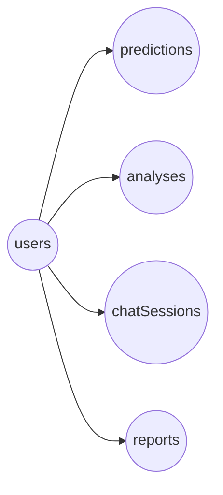
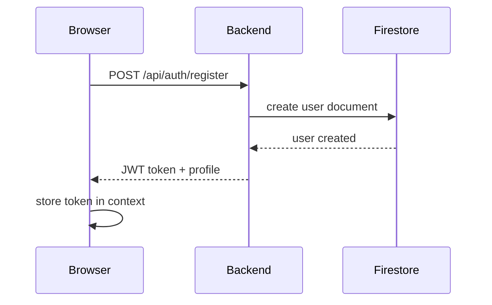
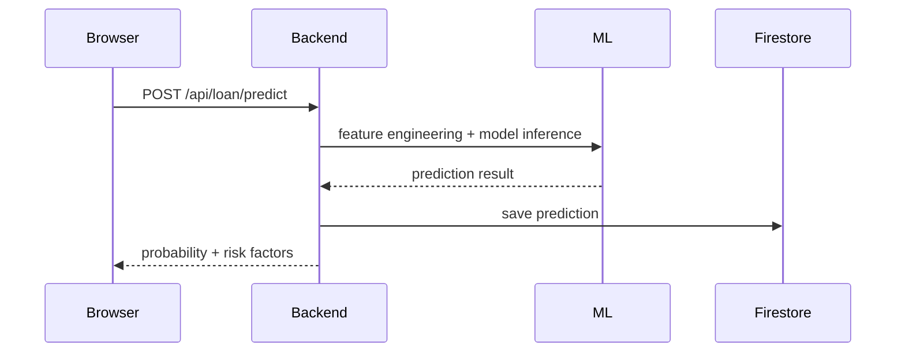
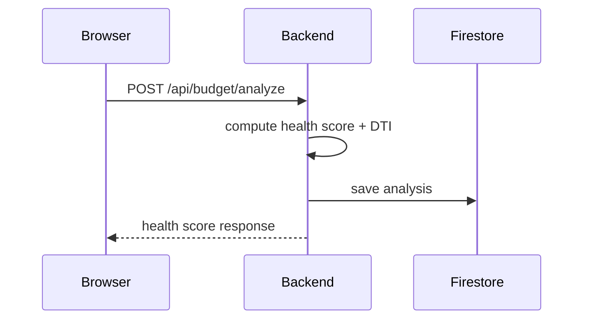
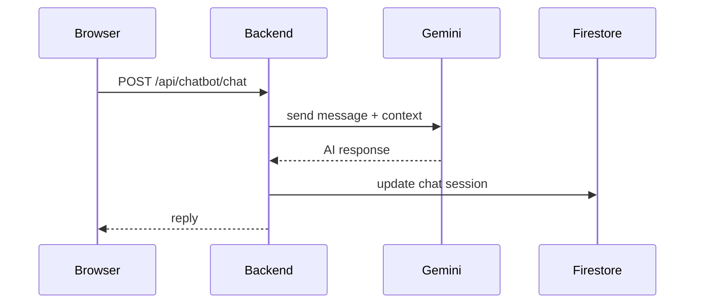
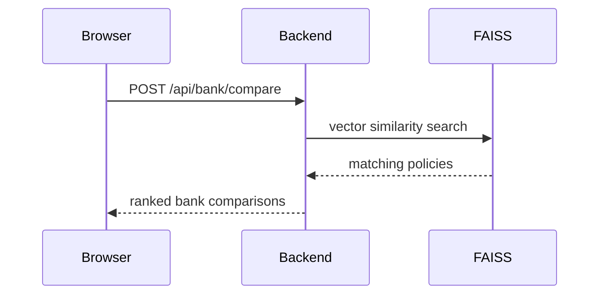
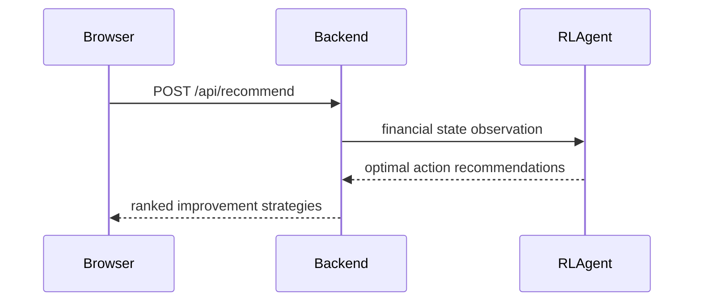

# SmartLoan AI — Web Platform


## Project Introduction
**Project Name:** SmartLoan AI — Web Platform

**Tagline:** Intelligent loan decision automation and personal finance advisory for the modern web.

**Executive Summary:**
SmartLoan AI is a production-ready fintech web platform built with a **React + Vite frontend** that connects to a secured **FastAPI (Python) backend** with integrated ML and Reinforcement Learning engines. The system delivers loan probability scoring, credit health analytics, EMI calculation, AI-driven conversational advice, bank comparison intelligence, and financial simulation — all through a responsive, modern web interface.

**Project Overview:**
The platform integrates:
- React (Vite) web application with Tailwind CSS for a rich, responsive UI
- FastAPI (Python) backend with Firebase Firestore persistence
- Integrated ML pipeline for loan prediction, scoring, and simulation
- Reinforcement Learning engine for personalized financial recommendations
- RAG-based bank policy intelligence with FAISS vector search
- AI chatbot powered by Google Gemini with rule-based fallbacks

---


## Project Highlights
- Production-ready React + Vite single-page web application
- FastAPI backend with ensemble ML prediction (Random Forest, XGBoost)
- Firebase Firestore database with JWT authentication
- AI chatbot with Gemini API integration and contextual financial advice
- Reinforcement Learning (Q-Learning) smart recommendation engine
- RAG-powered bank policy comparison using sentence-transformers & FAISS
- EMI calculator, budget analysis, and financial simulation tools
- End-to-end EDA pipeline with data cleaning, visualization, and model training
- Dark/Light theme support with modern glassmorphism UI

---


## Business Documentation
### Problem Statement
Many borrowers lack transparent, real-time decision support when evaluating loan eligibility and managing personal finance. Traditional tools provide generic guidance without ML-enabled risk analysis or tailored scenarios.

### Existing Challenges
- Fragmented loan advice across multiple services
- Limited visibility into approval probability and financial health
- Manual risk evaluation without predictive automation
- No centralized bank policy comparison for Pakistani financial institutions

### Proposed Solution
SmartLoan AI centralizes loan prediction, personal finance analytics, bank comparison, and conversational advisory into a single web experience backed by enterprise-grade backend services.

### Benefits
- Faster approval insight through AI ensemble models
- Personalized recommendations based on financial health via RL
- Reduced risk through analytics and real-time monitoring
- Bank-specific loan comparison with RAG intelligence
- Secure, scalable cloud architecture
- Clear engineer-ready project structure

### Objectives
- Provide real-time loan approval scoring through a web dashboard
- Enable health and risk analysis on customer data
- Maintain secure user authentication and session flow
- Build a reusable ML + RL backend for future feature expansion
- Deliver production-level documentation and modular code

### Target Users
- Loan applicants seeking better approval insight
- Financial advisors requiring rapid analysis
- Web-first consumers in Pakistan and emerging markets
- Product teams validating AI-enabled fintech workflows

---


## Technical Documentation
### Technology Stack

| Layer | Technology | Purpose |
|---|---|---|
| Frontend | React 19, Vite 8, Tailwind CSS 4 | Web application UI, routing, and state management |
| Backend | Python, FastAPI | REST API, auth, ML inference, RL recommendations |
| Database | Firebase Firestore | User, prediction, analysis, chat, and report persistence |
| ML Engine | scikit-learn, Random Forest, XGBoost | Loan prediction, feature engineering, model evaluation |
| RL Engine | Custom Q-Learning Agent | Personalized financial improvement recommendations |
| RAG / Bank Intelligence | sentence-transformers, FAISS | Bank policy vector search and comparison |
| AI Chatbot | Google Gemini API | Conversational financial advice |
| Charts | Recharts | Interactive data visualization on frontend |
| Auth | JWT (python-jose) + Firebase Auth | Secure token-based authentication |

### System Architecture

```
React + Vite Frontend (Browser)
   ↕ HTTPS / Axios
FastAPI Backend (Python)
   ├── ML Engine (scikit-learn)
   ├── RL Agent (Q-Learning)
   ├── RAG Bank Intelligence (FAISS)
   ├── AI Chatbot (Gemini API)
   ↕ Firestore SDK
Firebase Firestore Database
```

### Frontend Architecture
- React 19 single-page application built with Vite 8
- Tailwind CSS 4 for responsive, utility-first styling
- React Router DOM v7 for client-side routing
- Context API (AuthContext) for authentication state management
- Axios for all backend API communication
- Recharts for interactive data visualization
- Lucide React for iconography
- Dark/Light theme toggle with CSS data-attributes
- Protected routes with JWT token validation

### Backend Architecture
- `backend/app/main.py` bootstraps FastAPI with CORS, routers, and lifespan events
- Router modules separate domain logic: auth, loan, financial, chatbot, budget, recommendation, admin, EDA, reports, bank
- Firebase Firestore integration through `firebase-admin` SDK
- Auth middleware validates JWT tokens via `python-jose`
- ML model loaded on startup via `LoanService.load_model()`
- RL agent loaded on startup via `RLService.load_agent()`
- RAG bank intelligence served via FAISS index + sentence-transformers

### Database Architecture
- Firebase Firestore collections store structured documents
- Collections:
  - `users` — user profiles and auth data
  - `predictions` — loan prediction records per user
  - `analyses` — financial health, risk, and simulation history
  - `chatSessions` — AI chat session history
  - `reports` — generated report documents

### Machine Learning Architecture
- **Training Pipeline:** `backend/app/ml/train_model.py`
- **Feature Engineering:** `backend/app/ml/feature_engineering.py` — derives DTI ratio, savings ratio, requested EMI, loan-to-income
- **Preprocessing:** `backend/app/ml/preprocessing.py` — scaling, encoding, imputation
- **Model Stack:** Random Forest (primary) with model comparison (XGBoost, Logistic Regression)
- **Model Evaluation:** Full evaluation suite with confusion matrix, ROC curve, precision-recall curve, feature importance
- **Artifacts:** `trained_model.pkl`, `preprocessor.pkl`, `feature_names.json`, `model_comparison.json`
- **Evaluation Reports:** `backend/app/ml/evaluation/` — contains classification reports, confusion matrix, ROC/PR curves, feature importance charts

### Reinforcement Learning Architecture
- **Environment:** `backend/app/rl/environment.py` — financial state modeling
- **Agent:** `backend/app/rl/agent.py` — Q-Learning agent for recommendation generation
- **Training:** `backend/app/rl/train_agent.py` — trains the RL agent to learn optimal financial improvement strategies

### RAG / Bank Intelligence Architecture
- **Policy Ingestion:** `backend/app/rag/ingest_policies.py` — processes bank policy documents
- **Vector Index:** `backend/app/rag/policy_index.faiss` — FAISS vector index for similarity search
- **Metadata:** `backend/app/rag/policy_metadata.json` + `bank_policies.json` + `banks_raw.json`
- **Service:** `backend/app/services/rag_service.py` — retrieval-augmented generation for bank comparison

### Security Architecture
- JWT-based authentication for all protected API routes
- Password hashing and secure token generation
- CORS restrictions configurable via environment settings
- Firebase service account credentials stored securely (gitignored)
- Environment-based secret management via `.env` files

---


## Feature Documentation
### User Features

#### Registration and Login
- **Purpose:** Create secure user accounts and authenticate via the web UI.
- **Inputs:** `name`, `email`, `password`
- **Processing Logic:** Saves user data to Firestore, hashes password, issues JWT.
- **Outputs:** Auth token, user profile.
- **Benefits:** Secure onboarding with session persistence in the browser.
- **Implementation:** `backend/app/routers/auth.py`, `backend/app/services/auth_service.py`, `frontend/src/pages/LoginPage.jsx`

#### Dashboard
- **Purpose:** Present summary analytics and financial health metrics.
- **Inputs:** Authenticated user session.
- **Processing Logic:** Fetches loan stats, prediction history, and summary metrics.
- **Outputs:** Interactive charts (Recharts), summary cards, and historical data.
- **Benefits:** Real-time financial overview in a single glance.
- **Implementation:** `frontend/src/pages/DashboardPage.jsx`

#### Loan Eligibility Prediction
- **Purpose:** Estimate loan approval probability using ensemble ML models.
- **Inputs:** 10 demographic and financial features (age, income, credit score, loan amount, etc.).
- **Processing Logic:** Feature engineering → preprocessing → Random Forest/XGBoost inference.
- **Outputs:** Approval probability, risk classification, top contributing factors.
- **Benefits:** Faster decision support and full transparency into scoring.
- **Implementation:** `frontend/src/pages/LoanCheckerPage.jsx`, `backend/app/routers/loan.py`, `backend/app/services/loan_service.py`

#### EMI Calculator
- **Purpose:** Calculate Equated Monthly Installments for loan scenarios.
- **Inputs:** Loan amount, interest rate, loan tenure.
- **Processing Logic:** Standard EMI formula with amortization schedule.
- **Outputs:** Monthly EMI, total interest, total payable amount.
- **Benefits:** Quick financial planning before loan commitment.
- **Implementation:** `frontend/src/pages/EMICalculatorPage.jsx`, `backend/app/routers/budget.py`

#### Financial Simulation
- **Purpose:** Model future financial scenarios and "what-if" analysis.
- **Inputs:** Income/expense changes, loan variables.
- **Processing Logic:** Projected cash flow and savings impact calculations.
- **Outputs:** Scenario summary, projected balances, visual comparisons.
- **Benefits:** Better planning before committing to loans.
- **Implementation:** `frontend/src/pages/SimulationPage.jsx`, `backend/app/routers/financial.py`

#### Bank Comparison (RAG Intelligence)
- **Purpose:** Compare loan products across Pakistani banks using AI-powered policy search.
- **Inputs:** Loan type, amount, user profile preferences.
- **Processing Logic:** RAG pipeline queries FAISS vector index of bank policies.
- **Outputs:** Ranked bank comparisons, policy details, eligibility matches.
- **Benefits:** Informed bank selection backed by real policy data.
- **Implementation:** `frontend/src/pages/BankComparisonPage.jsx`, `backend/app/routers/bank.py`, `backend/app/services/rag_service.py`

#### AI Chat Assistant
- **Purpose:** Provide conversational financial advice and loan explanations.
- **Inputs:** Chat message, session context.
- **Processing Logic:** Gemini API intent classification with rule-based fallbacks.
- **Outputs:** Contextual financial advice and session logging.
- **Benefits:** Natural advice flow with fintech intelligence.
- **Implementation:** `frontend/src/pages/ChatbotPage.jsx`, `backend/app/routers/chatbot.py`, `backend/app/services/chatbot_service.py`

#### Smart Recommendations (RL-Powered)
- **Purpose:** Provide personalized strategies to improve loan eligibility.
- **Inputs:** User financial profile.
- **Processing Logic:** Q-Learning agent analyzes profile state and recommends optimal actions.
- **Outputs:** Ranked list of actionable improvement steps.
- **Benefits:** Data-driven, personalized financial improvement roadmap.
- **Implementation:** `frontend/src/pages/RecommendationsPage.jsx`, `backend/app/routers/recommendation.py`, `backend/app/services/rl_service.py`

### AI & ML Features

#### Loan Prediction Engine
- **Purpose:** Ensemble-based loan approval scoring.
- **Inputs:** Financial profile and requested loan terms.
- **Processing Logic:** Feature engineering, scaling, model inference, risk factor generation.
- **Outputs:** Approval probability, confidence score, top risk factors.
- **Implementation:** `backend/app/services/loan_service.py`, `backend/app/ml/`

#### Budget & Health Analysis
- **Purpose:** Evaluate user financial health and budget adequacy.
- **Inputs:** Income, expenses, savings, credit score, debts.
- **Processing Logic:** DTI ratio, savings rate, and composite health scoring.
- **Outputs:** Health score, grade, component breakdown, recommendations.
- **Implementation:** `backend/app/services/budget_service.py`

#### Reinforcement Learning Recommendations
- **Purpose:** Learn optimal financial improvement strategies.
- **Inputs:** Current financial state as RL environment observation.
- **Processing Logic:** Q-Learning agent selects best actions from learned policy.
- **Outputs:** Ordered list of financial improvement recommendations.
- **Implementation:** `backend/app/rl/`, `backend/app/services/rl_service.py`

### Administrative Features
- **Purpose:** Admin dashboard and service health monitoring.
- **Inputs:** Admin credentials.
- **Processing Logic:** User metrics, prediction accuracy, chat logs, system health.
- **Outputs:** Admin analytics and system status.
- **Implementation:** `backend/app/routers/admin.py`

---


## Database Documentation
This project uses **Firebase Firestore** as the primary database.

### Collections and Primary Keys
- `users` — user profiles and auth data (Firestore document ID as primary key)
- `predictions` — loan prediction records per user
- `analyses` — financial health, risk analysis, and simulation history
- `chatSessions` — AI chat session history
- `reports` — generated report documents

### Relationships
- `predictions.userId` → `users` document ID
- `analyses.userId` → `users` document ID
- `chatSessions.userId` → `users` document ID
- `reports.userId` → `users` document ID

### ER Outline



---


## EDA & Data Pipeline
### Exploratory Data Analysis Overview

The **Exploratory Data Analysis (EDA)** section documents the complete data journey from raw collection through preprocessing, analysis, visualization, and feature engineering that informs the ML models. All EDA artifacts, scripts, and datasets are located in the `eda/` folder.

### 1. Raw Data Layer

**Location:** `eda/data/raw/`

- **Source:** Loan application records (synthetically generated for training)
- **Format:** CSV (tabular structure)
- **Key Fields:**
  - **Financial Metrics:** `monthly_income`, `monthly_expenses`, `credit_score`, `savings_balance`, `loan_amount`
  - **Loan Details:** `loan_term_months`, `interest_rate`, `existing_loans`, `existing_emi`
  - **Risk Factors:** `missed_payments_last_year`, `bankruptcies`
  - **Demographics:** `age`, `gender`, `education`, `employment_status`
  - **Target Variable:** `approved` (binary: approved/rejected)

### 2. Data Cleaning & Preprocessing

**Script Location:** `eda/scripts/generate_sample_data.py`, `eda/scripts/generate_eda.py`

**Processing Steps:**
- Missing value handling (median/mode imputation)
- Outlier detection and treatment (IQR method)
- Feature engineering:
  - Debt-to-Income Ratio (DTI) = `(monthly_expenses + existing_emi) / monthly_income`
  - Requested EMI based on loan amount and term
  - Savings Ratio = `savings_balance / monthly_income`
  - Loan-to-Income Ratio = `loan_amount / annual_income`

**Output:** `eda/data/cleaned/`

### 3. EDA Report & Visualizations

**Report:** `eda/reports/eda_report.html`, `eda/reports/eda_report.json`
**Visualizations:** `eda/reports/visualizations/`

#### Key Findings
1. **Credit Score is Critical** — Low scores (<600) strongly associate with rejection
2. **DTI Ratio Matters Most** — Threshold around 0.4–0.5 separates approval tiers
3. **Missed Payments & Bankruptcies are Risk Multipliers** — Even one missed payment reduces approval by 30%+
4. **Income Thresholds Exist** — Minimum monthly income of ~5,000 needed for standard loans

### 4. Model Training Pipeline

Training scripts in `backend/app/ml/`:
- `train_model.py` — trains Random Forest and comparison models
- `feature_engineering.py` — derives all ML-ready features
- `preprocessing.py` — standardization and encoding pipeline
- `model_evaluation.py` — generates evaluation reports and charts

**Evaluation Outputs** (`backend/app/ml/evaluation/`):
- Confusion matrix, ROC curve, precision-recall curve
- Feature importance chart and classification report

---


## Workflow Documentation
### Authentication Flow



### Loan Prediction Flow



### Financial Analysis Flow



### AI Chat Flow



### Bank Comparison Flow (RAG)



### RL Recommendation Flow



---


## Installation Guide
### Prerequisites
- Node.js 20+ and npm
- Python 3.11+
- Firebase service account JSON for Firestore access
- Google Gemini API key (optional, for AI chatbot)

### Clone Repository
```bash
git clone https://github.com/Rameez-ai/Smart-Loan-AI_Web-Base.git
cd Smart-Loan-AI_Web-Base
```

### Backend Setup
```bash
cd backend
python -m venv venv

# Windows
venv\Scripts\Activate.ps1

# macOS / Linux
source venv/bin/activate

pip install -r requirements.txt
cp .env.example .env
# Update .env values: JWT_SECRET_KEY, GEMINI_API_KEY, Firebase credentials
```

Place your Firebase `serviceAccountKey.json` inside `backend/app/firebase/`.

### Frontend Setup
```bash
cd frontend
npm install
cp .env.local.example .env.local
# Update .env.local with your backend API URL
```

### EDA Pipeline (Optional — Re-training)
```bash
# Generate synthetic data
python eda/scripts/generate_sample_data.py

# Run EDA analysis
python eda/scripts/generate_eda.py

# Train ML model
cd backend/app
python -m ml.train_model

# Train RL agent
python -m rl.train_agent
```

---


## Running Guide
### Backend
```bash
cd backend/app
uvicorn main:app --reload --host 0.0.0.0 --port 8080
```
Backend listens on `http://localhost:8080` by default.
Swagger UI available at `http://localhost:8080/docs`.

### Frontend
```bash
cd frontend
npm run dev
```
Frontend dev server starts on `http://localhost:5173` by default.

### Production Build
```bash
cd frontend
npm run build
npm run preview
```

---


## API Documentation
### Authentication
- `POST /api/auth/register`
  - Body: `{ name, email, password }`
  - Response: `{ token, user }`

- `POST /api/auth/login`
  - Body: `{ email, password }`
  - Response: `{ token, user }`

- `GET /api/auth/me`
  - Auth: Bearer token
  - Response: user profile

### Loan Endpoints
- `POST /api/loan/predict`
  - Auth required
  - Body: financial and demographic inputs
  - Response: approval probability, risk factors, confidence

- `GET /api/loan/stats`
  - Auth required
  - Response: loan summary metrics and history

### Financial Endpoints
- `POST /api/budget/analyze`
  - Auth required
  - Body: financial profile
  - Response: health score, grade, component breakdown, recommendations

- `POST /api/financial/health-score`
  - Auth required
  - Body: financial profile
  - Response: computed health score

- `POST /api/financial/risk-analysis`
  - Auth required
  - Body: risk inputs
  - Response: risk analysis

- `POST /api/financial/simulate`
  - Auth required
  - Body: simulation variables
  - Response: projected scenario

### Chat Endpoints
- `POST /api/chatbot/chat`
  - Auth required
  - Body: `{ message, session_id }`
  - Response: AI chatbot reply

### Recommendation Endpoints
- `POST /api/recommend`
  - Auth required
  - Body: financial profile
  - Response: RL-powered improvement recommendations

### Bank Intelligence Endpoints
- `POST /api/bank/compare`
  - Auth required
  - Body: loan criteria
  - Response: ranked bank policy comparisons

### Report Endpoints
- `POST /api/reports/generate`
  - Auth required
  - Body: `{ type }`
  - Response: report document

- `GET /api/reports/history`
  - Auth required
  - Response: report list

### EDA Endpoints
- `GET /api/eda/report`
  - Response: EDA report data

### Admin Endpoints
- `GET /api/admin/stats`
  - Auth required (admin)
  - Response: system metrics and user analytics

### Health Endpoints
- `GET /` — Basic health check
- `GET /api/health` — Detailed service health with ML/RL status

---


## Project Structure
### Complete Project Hierarchy

```text
Smart Loan AI/
│
├── frontend/                              # React + Vite Web Application
│   ├── index.html                         # Entry HTML
│   ├── package.json                       # Dependencies and scripts
│   ├── vite.config.js                     # Vite configuration
│   ├── eslint.config.js                   # Linting rules
│   ├── public/                            # Static assets
│   ├── dist/                              # Production build output
│   └── src/
│       ├── main.jsx                       # App entry point
│       ├── App.jsx                        # Root component with routing
│       ├── index.css                      # Global styles (Tailwind)
│       ├── firebase.js                    # Firebase client config
│       ├── api/                           # Axios API client
│       ├── assets/                        # Images and static resources
│       ├── context/                       # React Context (AuthContext)
│       ├── components/
│       │   └── Sidebar.jsx                # Navigation sidebar
│       └── pages/
│           ├── LoginPage.jsx              # Authentication UI
│           ├── DashboardPage.jsx          # Financial dashboard
│           ├── LoanCheckerPage.jsx        # Loan eligibility prediction
│           ├── EMICalculatorPage.jsx      # EMI calculator tool
│           ├── SimulationPage.jsx         # Financial simulation
│           ├── ChatbotPage.jsx            # AI chat assistant
│           ├── RecommendationsPage.jsx    # RL-powered recommendations
│           └── BankComparisonPage.jsx     # RAG bank comparison
│
├── backend/                               # FastAPI Python Backend
│   ├── Dockerfile                         # Docker container definition
│   ├── requirements.txt                   # Python dependencies
│   ├── .env.example                       # Environment template
│   └── app/
│       ├── main.py                        # FastAPI application entry
│       ├── config.py                      # Settings and configuration
│       ├── firebase/                      # Firebase admin SDK setup
│       ├── models/
│       │   └── schemas.py                 # Pydantic request/response models
│       ├── routers/
│       │   ├── auth.py                    # Authentication routes
│       │   ├── loan.py                    # Loan prediction routes
│       │   ├── loan_stats.py              # Loan statistics routes
│       │   ├── financial.py               # Financial analysis routes
│       │   ├── budget.py                  # Budget analysis routes
│       │   ├── chatbot.py                 # AI chatbot routes
│       │   ├── recommendation.py          # RL recommendation routes
│       │   ├── bank.py                    # Bank comparison routes
│       │   ├── reports.py                 # Report generation routes
│       │   ├── admin.py                   # Admin dashboard routes
│       │   └── eda.py                     # EDA report routes
│       ├── services/
│       │   ├── auth_service.py            # Authentication logic
│       │   ├── loan_service.py            # ML prediction service
│       │   ├── budget_service.py          # Budget analysis service
│       │   ├── chatbot_service.py         # Gemini AI chatbot service
│       │   ├── rl_service.py              # RL recommendation service
│       │   ├── rag_service.py             # RAG bank intelligence service
│       │   └── eda_service.py             # EDA data service
│       ├── ml/
│       │   ├── train_model.py             # Model training pipeline
│       │   ├── feature_engineering.py     # Feature derivation
│       │   ├── preprocessing.py           # Data preprocessing
│       │   ├── model_evaluation.py        # Evaluation metrics and plots
│       │   ├── trained_model.pkl          # Serialized trained model
│       │   ├── preprocessor.pkl           # Fitted preprocessor
│       │   ├── feature_names.json         # Feature column metadata
│       │   ├── model_comparison.json      # Model comparison results
│       │   └── evaluation/               # Evaluation charts and reports
│       ├── rl/
│       │   ├── environment.py             # Financial RL environment
│       │   ├── agent.py                   # Q-Learning agent
│       │   └── train_agent.py             # RL training script
│       ├── rag/
│       │   ├── ingest_policies.py         # Policy ingestion pipeline
│       │   ├── policy_index.faiss         # FAISS vector index
│       │   ├── policy_metadata.json       # Policy metadata
│       │   ├── bank_policies.json         # Processed bank policies
│       │   └── banks_raw.json             # Raw bank data
│       └── utils/
│           ├── jwt_handler.py             # JWT token utilities
│           └── validators.py              # Input validation
│
├── eda/                                   # Exploratory Data Analysis
│   ├── data/
│   │   ├── raw/                           # Original dataset
│   │   └── cleaned/                       # Processed dataset
│   ├── scripts/
│   │   ├── generate_sample_data.py        # Synthetic data generation
│   │   └── generate_eda.py                # EDA analysis script
│   └── reports/
│       ├── eda_report.html                # HTML EDA report
│       ├── eda_report.json                # JSON EDA data
│       └── visualizations/                # Charts and plots
│
├── .gitignore                             # Git ignore rules
└── README.md                              # This file
```

### Folder Details
- **`frontend/`**: React + Vite web application with Tailwind CSS, React Router, Recharts, and Firebase client SDK.
- **`backend/`**: FastAPI REST API with ML inference, RL recommendations, RAG bank intelligence, and Firebase Firestore persistence.
  - **`backend/app/ml/`**: Complete ML pipeline — training, feature engineering, preprocessing, evaluation.
  - **`backend/app/rl/`**: Reinforcement Learning agent for personalized financial recommendations.
  - **`backend/app/rag/`**: RAG-based bank policy comparison using FAISS + sentence-transformers.
  - **`backend/app/services/`**: Business logic services for all domain features.
- **`eda/`**: End-to-end EDA pipeline from synthetic data generation through analysis and visualization.

---


## Developer Notes
- The **React frontend** is the primary user experience layer (located in `frontend/`).
- The **FastAPI backend** handles auth, ML inference, RL, RAG, and Firestore persistence (located in `backend/`).
- The **EDA pipeline** is independent and used for model training data preparation (located in `eda/`).
- Use `.env.example` and `.env.local` files to configure local development.
- Start the backend server before running the frontend dev server.
- The ML model and RL agent are loaded automatically on backend startup.
- Swagger API docs are available at `http://localhost:8080/docs` when the backend is running.

---


## User Journey
1. User opens the SmartLoan AI web application in their browser.
2. User registers or logs in via the Login page.
3. Backend creates/validates the user in Firestore and returns a JWT.
4. User lands on the Dashboard with financial summary and analytics.
5. User navigates to Loan Checker, enters financial details, and gets ML-powered approval prediction.
6. User explores EMI Calculator for monthly payment planning.
7. User runs financial simulations with "what-if" scenarios.
8. User compares bank loan products via the RAG-powered Bank Comparison page.
9. User receives personalized improvement strategies on the Recommendations page (RL-powered).
10. User chats with the AI assistant for financial guidance and loan explanations.

---


## Contributing Guidelines
Contributions should follow these rules:
- Keep changes small and focused
- Document new features in README or architecture docs
- Maintain consistent code organization within `frontend/`, `backend/`, and `eda/`
- Use Pydantic schemas for all new API endpoints
- Follow React component conventions (one component per file, context for shared state)
- Avoid committing credentials, `.env` files, or `serviceAccountKey.json`

---


## Future Enhancements
- Multi-bank integration with Open Banking APIs
- Fraud detection and anomaly monitoring
- AI chat assistant with voice support
- Predictive financial forecasting and budgeting
- Personalized loan marketplace recommendations
- Secure bank account linking and payment tracking
- Adaptive risk scoring using real-time market data
- Progressive Web App (PWA) support for mobile-like experience
- Real-time notifications for loan status updates

---


## License
This project is licensed under the terms of the [MIT License](LICENSE).

---
